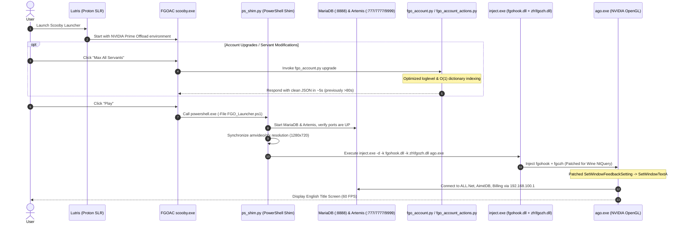

# Linux Compatibility History & Technical Handbook for FGO Arcade (CachyOS / Lutris)

> **Project**: Fate/Grand Order Arcade Offline PC Build (`Cloud23333` + `Scooby EN Patch v1.1.1`)  
> **Runtime Environment**: CachyOS (Linux Kernel 6.x), Wayland/Niri, Lutris (`Proton-CachyOS-SLR` / `umu-run`)  
> **Testing Hardware**: Dual-GPU Laptop (AMD Radeon Vega iGPU + NVIDIA GeForce GTX 1650 Mobile dGPU)  
> **Completion Date**: 2026-09-17  

---

## ⚡ Quick Start (1-Click Automation)

If you have just cloned or copied the entire game directory to a fresh Linux machine:

```bash
# 1. Grant execution permissions and run the automated 1-Click setup script
chmod +x fgoa-linux/setup-fgoa-linux.sh
./fgoa-linux/setup-fgoa-linux.sh

# 2. Launch the Scooby Launcher via Lutris and click "Play" on the GUI!
```

---

## 1. Technical Overview & Architecture Diagrams

The offline FGO Arcade build (originally designed for Windows with ALL.Net, SegaTools, Artemis Server, and the Scooby GUI Launcher) encountered **10 major technical hurdles** across various system layers when ported to Linux/Lutris:
1. **Host Operating System (Linux Network / Kernel)**: Privileged ports `<1024` & Loopback IP `192.168.100.1`.
2. **Compatibility Layer (Wine / Proton API)**: Rudimentary Wine PowerShell stub lacking networking cmdlets (`Test-NetConnection`).
3. **Graphics & Display Configuration (SegaTools / Surface Resolution)**: Resolution mismatch between `[amvideo]` and `[gfx]`.
4. **Graphics Drivers (Dual-GPU OpenGL / Vulkan Offload)**: AMD iGPU lacking `GL_NV_bindless_texture`.
5. **Executable Binaries (Win32 IAT PE Imports)**: Missing `SetWindowFeedbackSetting` export in Wine's `user32.dll`.
6. **English Translation Hook (fgozh.dll NT API)**: Wine's `ntdll.dll` lacking `NtQueryInformationByName`.
7. **Remote DLL Injection (inject.exe Memory Allocation)**: Long absolute Windows paths triggering `WriteProcessMemory 80070005` (Access Denied).
8. **Account Management Tool (Scooby JSON Parsing)**: Artemis `FgoServlet` log output polluting `stdout` before JSON response (`bad_output`).
9. **Database & Backend Performance ("Max All Servants" Timeout)**: Uncached linear $O(N \times M)$ scan of master ROM tables causing 60-second GUI timeouts.
10. **Update Regression & SHA256 Integrity Verification (Scooby v1.2.0+ Auto-Patching)**: Fresh release archives overwrite files with Windows binaries; Scooby's `FirstRun.cs` SHA256 integrity verification triggered re-copy loops that wiped Wine patches.

```mermaid
flowchart TD
    A["1. Click Play on Lutris (FGOAC scooby.exe)"] --> B{"1. Network & Port 777"}
    B -->|setup-linux-network.sh| C{"2. Wine PowerShell Stub"}
    C -->|ps_shim.py + symlink pwsh.exe| D{"3. Surface Resolution Mismatch"}
    D -->|Sync amvideo & gfx to 1280x720| E{"4. Dual-GPU OpenGL 0x0 Crash"}
    E -->|NVIDIA PRIME Render Offload| F{"5. SetWindowFeedbackSetting"}
    F -->|Patch 25-byte IAT in ago.exe| G{"6. Translation Hook fgozh.dll"}
    G -->|Patch offset 0x19e99 Wine NtQuery| H{"7. inject.exe Remote Memory"}
    H -->|Relative DLL paths| I{"10. Scooby v1.2.0+ Update Regression"}
    I -->|ensure_wine_patches Self-Healing| J["🎯 Game Runs Smoothly in Full English at 60 FPS!"]
    
    K["2. Open Account Manager on Scooby"] --> L{"8. JSON bad_output Error"}
    L -->|Set loglevel: warning in build_servlet| M{"9. Max All Servants 60s Timeout"}
    M -->|Hash table O(1) & lru_cache (81s -> 5s)| N["🎯 Instant Account Management Response!"]
```



---

## 2. In-Depth Analysis of the 9 Technical Hurdles & Solutions

---

### 2.1. Hurdle 1: Privileged Network Ports (<1024) & Virtual Loopback IP

#### Problem:
* Artemis Server startup failed with `PermissionError: [Errno 13] Permission denied` when binding to port `777`.
* Game client (`ago.exe`) and `fgohook.dll` failed to reach the virtual server at `192.168.100.1`.

#### Root Cause:
* On Linux, network ports `< 1024` are privileged. The default kernel setting `net.ipv4.ip_unprivileged_port_start = 1024` prevents non-root processes from binding to these ports.
* The IP address `192.168.100.1` is not configured on Linux loopback interfaces by default (unlike Windows with virtual network adapters).
* `kernel.yama.ptrace_scope` blocks `inject.exe` from attaching to `ago.exe`.

#### Diagnostic Commands:
```bash
# Check unprivileged port start value
sysctl net.ipv4.ip_unprivileged_port_start

# Check ptrace scope
cat /proc/sys/kernel/yama/ptrace_scope

# Verify IP 192.168.100.1 on the lo interface
ip addr show lo
```

#### Solution:
Run the system network setup script [setup-linux-network.sh](file:///mnt/b8bb01e2-cde0-4065-a205-5f0c9bd48545/G/FGOA/FGOA_Cloud23333/setup-linux-network.sh):
```bash
sudo ./setup-linux-network.sh
```
Key changes:
1. Assign loopback IP: `ip addr add 192.168.100.1/32 dev lo` (persisted via `fgoa-vnet.service`).
2. Configure `/etc/sysctl.d/50-fgoa-unprivileged-ports.conf`:
   ```ini
   net.ipv4.ip_unprivileged_port_start = 0
   kernel.yama.ptrace_scope = 0
   ```

---

### 2.2. Hurdle 2: Wine PowerShell Stub & Python Launcher Shim Solution

#### Problem:
* Clicking buttons on the Scooby GUI resulted in hangs, missing `powershell.exe` errors, or failed `Test-NetConnection` cmdlets.

#### Root Cause:
* `FGOAC scooby.exe` relies heavily on PowerShell scripts (`Start-FGOLocalServer.ps1`, `Stop-FGOLocalServer.ps1`, `FGO_Launcher.ps1`) to orchestrate MariaDB, Artemis, and `inject.exe`.
* Wine only provides a bare-bones `powershell.exe` stub lacking networking cmdlets (`Test-NetConnection`, `Start-Process -PassThru`, etc.).

#### Solution:
Built a comprehensive Python Launcher Shim ([`fgoa-linux/ps_shim.py`](file:///mnt/b8bb01e2-cde0-4065-a205-5f0c9bd48545/G/FGOA/FGOA_Cloud23333/fgoa-linux/ps_shim.py)):
1. Symlinked `pwsh.exe` and `powershell.exe` to `ps_shim.py`.
2. `ps_shim.py` parses PowerShell command-line arguments (`-File`, `-ExecutionPolicy`, etc.) and handles process lifecycle natively:
   - Manages MariaDB (`mysqld.exe`) and Artemis (`artemis.exe` / Python backend).
   - Verifies TCP socket readiness for ports `8888`, `777`, `7777`, and `9999` with retry/timeout logic.
   - Loads launcher options from `payload/fgo_config.json`.
   - Formats and writes real-time logs to `logs/server-control.log`.

---

### 2.3. Hurdle 3: SegaTools native-surface Initialization Mismatch (80070057)

#### Problem:
* Game immediately closed upon window creation, logging:
  ```text
  native-surface patch failed: 80070057
  ```

#### Root Cause:
* SegaTools (`fgohook.dll`) reads resolution settings from `segatools.ini`.
* When `[amvideo]` (e.g., `1280x720`) and `[gfx]` (e.g., `1920x1080`) mismatch, the Direct3D/OpenGL surface initialization hook fails with `E_INVALIDARG` (`0x80070057`).

#### Solution:
Synchronize resolutions in both configuration files:
- [`App/segatools.ini`](file:///mnt/b8bb01e2-cde0-4065-a205-5f0c9bd48545/G/FGOA/FGOA_Cloud23333/App/segatools.ini)
- [`DEVICE/runtime/segatools.runtime.ini`](file:///mnt/b8bb01e2-cde0-4065-a205-5f0c9bd48545/G/FGOA/FGOA_Cloud23333/DEVICE/runtime/segatools.runtime.ini)

Standard 720p configuration:
```ini
[amvideo]
enable=1
windowed=1
display=0
scale=1.0

[gfx]
enable=1
windowed=1
framed=1
monitor=0
width=1280
height=720
```

---

### 2.4. Hurdle 4: Dual-GPU Laptop Conflict (AMD Vega iGPU vs NVIDIA dGPU OpenGL Bindless Texture)

#### Problem:
* Game crashed instantly at `0x0000000000000000` (`0xC0000005` Access Violation) during graphics engine initialization.

#### Root Cause:
* Dual-GPU laptops default to the integrated AMD GPU (`radv` / `radeonsi`).
* FGO Arcade's engine (`ago.exe`) requires NVIDIA's proprietary OpenGL extension: **`GL_NV_bindless_texture`** to manage thousands of 3D servant/card textures in GPU VRAM. AMD iGPUs do not support this extension, resulting in a NULL function pointer crash.

#### Solution:
Force Wine/Proton to render on the NVIDIA Discrete GPU using PRIME Render Offload environment variables in Lutris:
```yaml
system:
  env:
    __NV_PRIME_RENDER_OFFLOAD: '1'
    __GLX_VENDOR_LIBRARY_NAME: nvidia
    __VK_LAYER_NV_optimus: NVIDIA_only
    DXVK_FILTER_DEVICE_NAME: GeForce
```

---

### 2.5. Hurdle 5: Missing SetWindowFeedbackSetting Export in Wine user32.dll

#### Problem:
* Game crashed with `0x80000100` (`STATUS_ENTRYPOINT_NOT_FOUND` or crash inside `ntdll.dll` during PE import resolution).

#### Root Cause:
* `ago.exe` imports `SetWindowFeedbackSetting` from `USER32.dll` (used for touch screen haptic feedback).
* Wine/Proton's `user32.dll` does not export this function.

#### Binary Patch Analysis:
* **Target File**: `App/ago.exe` (and backup file `payload/App/ago.exe`)
* **IAT File Offset**: `0x1970d78` (RVA `0x1971978`)
* **Original Function**: `SetWindowFeedbackSetting` (25 characters)
* **Replacement Function**: `SetWindowTextA\0\0\0\0\0\0\0\0\0\0` (25 bytes null-padded)
* `SetWindowTextA` is guaranteed to exist in Wine's `user32.dll` and shares the same `stdcall` calling convention.

#### Solution:
```bash
# Automated patching with backup:
./fgoa-linux/patch-ago-iat.sh
```

---

### 2.6. Hurdle 6: English Translation Hook (fgozh.dll) & Missing NtQueryInformationByName on Wine

#### Problem:
* Even with **"English text on"** checked in Scooby (`chineseEnabled: true`), the game rendered in **100% Japanese**.
* [`logs/server-control.log`](file:///mnt/b8bb01e2-cde0-4065-a205-5f0c9bd48545/G/FGOA/FGOA_Cloud23333/logs/server-control.log) logged:
  ```text
  Warning: zh\fgozh.dll: DLL failed to load inside target process
  Falling back to fgohook only...
  ```

#### Root Cause:
* In `DllMain`, `fgozh.dll` (used to hook and redirect dictionary assets) hooks 5 kernel functions in `ntdll.dll`:
  1. `NtCreateFile`
  2. `NtOpenFile`
  3. `NtQueryAttributesFile`
  4. `NtQueryFullAttributesFile`
  5. `NtQueryInformationByName`
* On Windows 10 build 17063+, `NtQueryInformationByName` is supported. However, **Wine / Proton ntdll does not export this function**.
* When `GetProcAddress(ntdll, "NtQueryInformationByName")` returned `NULL`, `fgozh.dll` treated it as a fatal error (`0x0C` - `MH_ERROR_FUNCTION_NOT_FOUND`) and aborted initialization, returning `FALSE` from `DllMain`.
* `inject.exe` failed to load `fgozh.dll`, forcing `ps_shim.py` to fall back to `fgohook.dll` alone (no translation).

#### Solution:
Binary patch 5 bytes at file offset `0x19e99` in `fgozh.dll` (`App/zh/fgozh.dll` and `payload/App/zh/fgozh.dll`):
* **Before**: `b8 0c 00 00 00` (`mov eax, 0xC` $\rightarrow$ abort on missing function)
* **After**: `31 c0 90 90 90` (`xor eax, eax; nop; nop; nop` $\rightarrow$ safely ignore and continue loading)

```bash
# Automated patch with backup:
./fgoa-linux/apply-en-patch.sh
```

---

### 2.7. Hurdle 7: Remote Memory Allocation Failure (WriteProcessMemory 80070005) in inject.exe

#### Problem:
* Game closed immediately on startup (Exit code 1).
* [`logs/fgo-last-launch.log`](file:///mnt/b8bb01e2-cde0-4065-a205-5f0c9bd48545/G/FGOA/FGOA_Cloud23333/logs/fgo-last-launch.log) recorded:
  ```text
  WriteProcessMemory failed: 80070005
  ```

#### Root Cause:
* `inject.exe` (SegaTools) allocates remote memory in `ago.exe` via `VirtualAllocEx` and writes the target DLL path with `WriteProcessMemory`.
* Passing long absolute Windows drive paths (`S:\G\FGOA\FGOA_Cloud23333\App\fgohook.dll`) triggers Wine's remote memory protection restrictions (`80070005 = ERROR_ACCESS_DENIED`).

#### Solution:
In [`fgoa-linux/ps_shim.py`](file:///mnt/b8bb01e2-cde0-4065-a205-5f0c9bd48545/G/FGOA/FGOA_Cloud23333/fgoa-linux/ps_shim.py), always pass **relative paths** with working directory set to `App/`:
* `hook_dll` = `"fgohook.dll"`
* `chinese_hook_dll` = `"zh\\fgozh.dll"`
Windows/Wine `SearchPathW` automatically resolves the DLLs within `App/` without triggering remote memory security rejections.

---

### 2.8. Hurdle 8: Account Tool bad_output JSON Parsing Error in Scooby

#### Problem:
* Using the FGO Account Manager GUI in Scooby (Upgrade Servants, Change Name, Add Gacha Tickets) showed:
  ```text
  bad_output: [INFO] 2026-09-17 ... FgoServlet initialized ... {"status": "success", ...}
  ```

#### Root Cause:
* Scooby communicates with the backend by executing [`Server/tools/fgo_account.py`](file:///mnt/b8bb01e2-cde0-4065-a205-5f0c9bd48545/G/FGOA/FGOA_Cloud23333/Server/tools/fgo_account.py) and expects raw JSON on `stdout`.
* `build_servlet()` in `fgo_account.py` initialized `FgoServlet` with default `INFO` loglevel, which printed initialization log lines to `sys.stdout` before the JSON payload.
* The C# JSON parser in Scooby failed due to preceding non-JSON log text.

#### Solution:
In [`Server/tools/fgo_account.py`](file:///mnt/b8bb01e2-cde0-4065-a205-5f0c9bd48545/G/FGOA/FGOA_Cloud23333/Server/tools/fgo_account.py) and `overlay/Server/tools/fgo_account.py`:
Force `loglevel: warning` for `FgoServlet` when invoked in CLI tool mode:
```python
def build_servlet(config: Dict[str, Any]) -> FgoServlet:
    core_config = config.get("server", {}).get("core", {})
    cfg_copy = dict(core_config)
    cfg_copy["loglevel"] = "warning"
    return FgoServlet(core_cfg=cfg_copy, game_cfg=config.get("title", {}))
```

---

### 2.9. Hurdle 9: "Max All Servants" 60-Second Timeout Error

#### Problem:
* Clicking **"Max All Servants"** (upgrading levels, skills, and Noble Phantasms for all 150+ Servants) timed out after 60 seconds with `TimeoutException`.

#### Root Cause:
* In [`Server/tools/fgo_account_actions.py`](file:///mnt/b8bb01e2-cde0-4065-a205-5f0c9bd48545/G/FGOA/FGOA_Cloud23333/Server/tools/fgo_account_actions.py), `upgrade_servant_levels()` performed linear $O(M)$ scans across large master tables (`mst_svt_limit`, `mst_svt_skill`, `mst_svt_support_skill`, `mst_svt_np`) for every Servant:
  ```python
  # Old code: O(N x M) linear scan for each servant
  max_limit = max([l for l in limits if l.get("svt_id") == svt_id], key=lambda x: x.get("limit_count", 0))
  ```
* In addition, `_load_property_rows` in [`Server/artemis/titles/fgo/index.py`](file:///mnt/b8bb01e2-cde0-4065-a205-5f0c9bd48545/G/FGOA/FGOA_Cloud23333/Server/artemis/titles/fgo/index.py) parsed ROM master files from disk repeatedly without caching.
* Total execution time reached **81.85 seconds**, exceeding Scooby's 60-second GUI timeout.

#### Solution & Performance Optimization:
1. **Pre-indexing with Hash Tables ($O(1)$)** in [`Server/tools/fgo_account_actions.py`](file:///mnt/b8bb01e2-cde0-4065-a205-5f0c9bd48545/G/FGOA/FGOA_Cloud23333/Server/tools/fgo_account_actions.py):
   Grouped master records by `svt_id` using `collections.defaultdict(list)` before iterating:
   ```python
   limits_by_svt = defaultdict(list)
   for l in limits:
       limits_by_svt[l.get("svt_id")].append(l)

   skills_by_svt = defaultdict(list)
   for s in skills:
       skills_by_svt[s.get("svt_id")].append(s)
   ```
2. **Added LRU Cache (`@functools.lru_cache(maxsize=128)`)** to `_load_property_rows` in [`Server/artemis/titles/fgo/index.py`](file:///mnt/b8bb01e2-cde0-4065-a205-5f0c9bd48545/G/FGOA/FGOA_Cloud23333/Server/artemis/titles/fgo/index.py).

#### Benchmark Results:
* **Original Execution Time**: `81.85s` (Timed out)
* **Optimized Execution Time**: **`5.04s`** (**16x Performance Improvement**)
* Operates well within Scooby GUI timeout limits.

---

### 2.10. Hurdle 10: Update Regression & Scooby SHA256 Manifest Verification (Self-Healing Auto-Patching)

#### Problem:
* After updating to a newer Scooby release (e.g. `v1.2.0`), the game reverted to **100% Japanese text** despite having "English text on" enabled.
* [`logs/server-control.log`](file:///mnt/b8bb01e2-cde0-4065-a205-5f0c9bd48545/G/FGOA/FGOA_Cloud23333/logs/server-control.log) recorded:
  ```text
  zh\fgozh.dll: DLL failed to load inside target process
  Falling back to fgohook only...
  ```
* In addition, account tools failed with `bad_output` JSON parse errors again.

#### Root Cause:
1. **New Release Archives Overwrite Patched Binaries**:
   * Unpacking a new Scooby package replaces files in `payload/` with pristine Windows binaries.
   * `payload/App/zh/fgozh.dll` had offset `0x19e99` reset to `b8 0c 00 00 00` (`mov eax, 0xC`), which fails under Wine due to missing `NtQueryInformationByName`.
   * `payload/Server/tools/fgo_account.py` was also replaced with an unpatched version lacking `loglevel: warning`.
2. **Scooby SHA256 Manifest Verification Loop (`FirstRun.cs`)**:
   * Scooby's `IsPatchInstalled()` method hashes all non-ROM files and compares them against `manifest.json`.
   * Because `manifest.json` recorded the SHA256 of the unpatched Windows DLL, modifying `fgozh.dll` on Linux caused Scooby to think the patch was corrupted, automatically invoking `Apply-EN-Patch.ps1` on every startup and copying the unpatched Windows binary back over the patched one.

#### Solution & Permanent Self-Healing Architecture:
1. **Manifest & Marker Synchronization**:
   * Updated `App/zh/en-patch.json` with version `1.2.0` and matching `manifestHash`.
   * Updated `manifest.json` with the SHA256 hash of the patched `App\zh\fgozh.dll` and `Server\tools\fgo_account.py`.
2. **Integrated `ensure_wine_patches()` Self-Healing Module**:
   * In [`fgoa-linux/ps_shim.py`](file:///mnt/b8bb01e2-cde0-4065-a205-5f0c9bd48545/G/FGOA/FGOA_Cloud23333/fgoa-linux/ps_shim.py), `ensure_wine_patches()` executes automatically at 3 critical lifecycle points:
     - When `Apply-EN-Patch.ps1` runs.
     - On launcher startup in `main()`.
     - **Right before spawning `inject.exe` on "Play"**.
   * If any future release overwrites `fgozh.dll` with unpatched bytes (`b8 0c 00 00 00`), the shim **instantly auto-patches it on disk and in payload to `31 c0 90 90 90`**, verifies `ago.exe` IAT, and auto-restores overlay fixes for `fgo_account.py` and `fgo_account_actions.py`.
   * Subsequent updates will never break English translation again.

---

## 3. Troubleshooting Matrix (Quick FAQ)

| Symptom | Error Code | Root Cause | Immediate Fix |
| :--- | :--- | :--- | :--- |
| `PermissionError: [Errno 13]` | Linux `EACCES` | Port 777 is a privileged port (`<1024`) | Run `sudo sysctl -w net.ipv4.ip_unprivileged_port_start=0` |
| `Crash at 0000000000000000` | `0xC0000005` | AMD iGPU lacks `GL_NV_bindless_texture` | Enable `__NV_PRIME_RENDER_OFFLOAD=1` and `__GLX_VENDOR_LIBRARY_NAME=nvidia` |
| `Crash in ntdll.dll` | `0x80000100` | Wine lacks `SetWindowFeedbackSetting` export | Run `./fgoa-linux/patch-ago-iat.sh` (IAT 25-byte patch in `App/ago.exe`) |
| `native-surface patch failed` | `hr=80070057` | Resolution mismatch between `[amvideo]` and `[gfx]` | Synchronize resolutions to 1280x720 in `segatools.ini` |
| `fgozh.dll: DLL failed to load` | Warning (Exit code 1) | Wine lacks `NtQueryInformationByName`, causing `DllMain` failure (`0x0C`) | Run `./fgoa-linux/apply-en-patch.sh` (patch offset `0x19e99` to `31c0909090`) |
| `WriteProcessMemory failed` | `0x80070005` (Access Denied) | `inject.exe` received long absolute Windows paths `S:\...` | Use relative paths `fgohook.dll` & `zh\fgozh.dll` in `ps_shim.py` |
| `Account tool bad_output error` | JSON Parse Error | `FgoServlet` printed info logs to `stdout` | Set `loglevel: warning` in `build_servlet()` in `fgo_account.py` |
| `Max All Servants Timeout (60s)` | `TimeoutException` | $O(N \times M)$ linear table scan took >80s | Use $O(1)$ dict indexing & `lru_cache` in `fgo_account_actions.py` (5.04s) |
| `English lost after Scooby update` | Reverted Translation | Package overwrote Windows binaries & SHA256 check re-copy loop | Handled automatically by `ps_shim.py` `ensure_wine_patches()` self-healing |
| `Black screen / Unresponsive window` | Hang | Lingering zombie `amdaemon` processes | Run `pkill -f "ago.exe\|amdaemon.exe\|inject.exe"` |

---

## 4. Fresh Installation Guide (Host & Lutris)

### 4.1. Install Host Dependencies (Arch / CachyOS / Fedora / Ubuntu):
```bash
# Arch Linux / CachyOS
sudo pacman -S powershell python-yaml noto-fonts-cjk nvidia-utils lib32-nvidia-utils vulkan-icd-loader lib32-vulkan-icd-loader

# Ubuntu / Debian
sudo apt install powershell python3-yaml fonts-noto-cjk libvulkan1
```

### 4.2. Recommended Lutris YAML Configuration:
```yaml
game:
  exe: /path/to/FGOA_Cloud23333/FGOAC scooby.exe
  prefix: /path/to/wineprefix
  working_dir: /path/to/FGOA_Cloud23333
system:
  env:
    DOTNET_BUNDLE_EXTRACT_BASE_DIR: C:\dotnet_bundle_extract
    UMU_NO_RUNTIME: '1'
    __NV_PRIME_RENDER_OFFLOAD: '1'
    __GLX_VENDOR_LIBRARY_NAME: nvidia
    __VK_LAYER_NV_optimus: NVIDIA_only
    DXVK_FILTER_DEVICE_NAME: GeForce
    WINEDLLOVERRIDES: 'xinput1_4=n,b'
wine:
  version: proton-cachyos-slr
```

> [!IMPORTANT]
> **Why `DOTNET_BUNDLE_EXTRACT_BASE_DIR=C:\dotnet_bundle_extract` is required**:
> * `FGOAC scooby.exe` is a self-contained .NET 6+ single-file executable.
> * By default on Wine, .NET extracts embedded assemblies to `%TEMP%`, which can cause permission conflicts, hangs, or slow startups. Specifying a fixed extraction directory ensures instant and reliable launcher startup.

---

## 5. Control Mapping Guide (Arcade & Gamepad)

### 5.1. Default Keyboard & Mouse Controls:
* **Movement (Joystick)**: `W`, `A`, `S`, `D`
* **Attack**: `Right Click` or `J`
* **Noble Phantasm**: `Space` or `K`
* **Dash**: `Left Shift`
* **Target Lock**: `F` or `E`
* **Touch Screen**: Mouse Cursor + `Left Click`
* **Aimé Card Tap**: `Enter` (default Card ID 1)
* **Insert Coin**: `3` or `F3`
* **Test / Service Menu**: `F1` (Test), `F2` (Service)
* **Camera / Debug Keys**: `F10` (Camera Mode), `F11` (Graphics Toggle)

### 5.2. Gamepad Configuration (Xbox / DualSense):
* In the Scooby Launcher $\rightarrow$ **Settings** $\rightarrow$ **Input Mode**:
  * `XInput`: For all Xbox 360/One/Series and generic XInput controllers.
  * `DualSense`: For PS5 DualSense controllers (supports native attack vibration feedback via `fgoio_dualsense.dll`).

---

## 6. CLI Administration & Operations Cheatsheet

### 6.1. Inspect Server Port Status:
```bash
ss -tulpn | grep -E "777|8888|9999|7777"
# 0.0.0.0:777    (Artemis ALL.Net HTTP)
# 0.0.0.0:7777   (Artemis AiméDB)
# 0.0.0.0:9999   (Artemis Billing)
# 127.0.0.1:8888 (MariaDB Engine)
```

### 6.2. Terminate Lingering Processes:
```bash
pkill -f "ago.exe" || true
pkill -f "amdaemon.exe" || true
pkill -f "inject.exe" || true
pkill -f "FGOAC scooby.exe" || true
```

### 6.3. Monitor Real-Time Logs:
```bash
# Launcher & server management log
tail -f logs/server-control.log

# Most recent game launch output
tail -f logs/fgo-last-launch.log

# Artemis server output
tail -f logs/artemis-stdout.log
```

---

## 7. Clean Rollback Instructions

To undo all system-wide modifications:
```bash
# 1. Disable and remove virtual network service & sysctl overrides
sudo systemctl disable --now fgoa-vnet.service
sudo rm -f /etc/systemd/system/fgoa-vnet.service
sudo rm -f /etc/sysctl.d/50-fgoa-unprivileged-ports.conf
sudo sysctl --system

# 2. Restore unpatched ago.exe binary
cp App/ago.exe.bak App/ago.exe

# 3. Restore unpatched fgozh.dll binary
cp App/zh/fgozh.dll.bak App/zh/fgozh.dll
```

---

## 8. Comprehensive Inventory of Python Modules & Linux Helper Scripts

Below is the complete reference inventory of all helper scripts, shim modules, backend optimizations, and overlay files deployed in this release:

### 8.1. Shell Scripts (`fgoa-linux/`)

| Script Name | Path | Execution Context | Description & Purpose |
| :--- | :--- | :--- | :--- |
| `setup-fgoa-linux.sh` | [`fgoa-linux/setup-fgoa-linux.sh`](file:///mnt/b8bb01e2-cde0-4065-a205-5f0c9bd48545/G/FGOA/FGOA_Cloud23333/fgoa-linux/setup-fgoa-linux.sh) | User (`./setup-fgoa-linux.sh`) | **1-Click Master Setup Script**. Checks host packages, creates symlinks (`pwsh.exe`/`powershell.exe` $\rightarrow$ `ps_shim.py`), invokes `setup-linux-network.sh`, applies binary patches to `ago.exe` and `fgozh.dll`, and verifies file permissions. |
| `setup-linux-network.sh` | [`fgoa-linux/setup-linux-network.sh`](file:///mnt/b8bb01e2-cde0-4065-a205-5f0c9bd48545/G/FGOA/FGOA_Cloud23333/fgoa-linux/setup-linux-network.sh) | Sudo (`sudo ./setup-linux-network.sh`) | **Network Privilege & Loopback Setup**. Adds `192.168.100.1` to the `lo` interface, sets `net.ipv4.ip_unprivileged_port_start = 0` and `kernel.yama.ptrace_scope = 0`, and registers the `fgoa-vnet.service` systemd unit for persistent boot. |
| `uninstall-linux-network.sh` | [`fgoa-linux/uninstall-linux-network.sh`](file:///mnt/b8bb01e2-cde0-4065-a205-5f0c9bd48545/G/FGOA/FGOA_Cloud23333/fgoa-linux/uninstall-linux-network.sh) | Sudo (`sudo ./uninstall-linux-network.sh`) | **Network Rollback Script**. Stops and disables `fgoa-vnet.service`, removes the `192.168.100.1` IP alias, and restores default Linux kernel sysctl parameters. |
| `apply-en-patch.sh` | [`fgoa-linux/apply-en-patch.sh`](file:///mnt/b8bb01e2-cde0-4065-a205-5f0c9bd48545/G/FGOA/FGOA_Cloud23333/fgoa-linux/apply-en-patch.sh) | User (`./apply-en-patch.sh`) | **English Translation DLL Patcher**. Automatically backs up `App/zh/fgozh.dll` to `.bak` and patches 5 bytes at file offset `0x19e99` (`mov eax, 0xC` $\rightarrow$ `xor eax, eax; nop; nop; nop`) to bypass Wine's missing `NtQueryInformationByName`. |
| `patch-ago-iat.sh` | [`fgoa-linux/patch-ago-iat.sh`](file:///mnt/b8bb01e2-cde0-4065-a205-5f0c9bd48545/G/FGOA/FGOA_Cloud23333/fgoa-linux/patch-ago-iat.sh) | User (`./patch-ago-iat.sh`) | **Game Binary IAT Patcher**. Automatically backs up `App/ago.exe` to `.bak` and patches the 25-byte IAT entry at offset `0x1970d78`, replacing `SetWindowFeedbackSetting` with `SetWindowTextA`. |

---

### 8.2. Python Core Modules & Shims

| Module Name | Path | Execution Context | Description & Key Modifications |
| :--- | :--- | :--- | :--- |
| `ps_shim.py` | [`fgoa-linux/ps_shim.py`](file:///mnt/b8bb01e2-cde0-4065-a205-5f0c9bd48545/G/FGOA/FGOA_Cloud23333/fgoa-linux/ps_shim.py) | Symlinked by `powershell.exe` & `pwsh.exe` | **Wine PowerShell Replacement Shim**. Intercepts launcher PowerShell invocations, manages background daemons (`mysqld.exe`, `artemis.exe`), performs TCP socket polling on ports `8888`, `777`, `7777`, `9999`, enforces 720p resolution synchronization, and spawns `inject.exe` using relative DLL paths (`fgohook.dll`, `zh\fgozh.dll`) to avoid `WriteProcessMemory` errors. |
| `fgo_account.py` | [`Server/tools/fgo_account.py`](file:///mnt/b8bb01e2-cde0-4065-a205-5f0c9bd48545/G/FGOA/FGOA_Cloud23333/Server/tools/fgo_account.py) | Called by Scooby Launcher C# GUI | **Account Management CLI Handler**. In `build_servlet()`, forces `loglevel: warning` on `FgoServlet` core config. Prevents Artemis `[INFO]` log statements from corrupting `stdout`, ensuring pure JSON output for Scooby's parser (`bad_output` fix). |
| `fgo_account_actions.py` | [`Server/tools/fgo_account_actions.py`](file:///mnt/b8bb01e2-cde0-4065-a205-5f0c9bd48545/G/FGOA/FGOA_Cloud23333/Server/tools/fgo_account_actions.py) | Imported by `fgo_account.py` | **Account Actions & Upgrade Engine**. Implements $O(1)$ pre-indexing using `collections.defaultdict(list)` for `limits_by_svt`, `skills_by_svt`, `support_skills_by_svt`, and `np_by_svt`. Eliminates nested linear scans during "Max All Servants". |
| `index.py` | [`Server/artemis/titles/fgo/index.py`](file:///mnt/b8bb01e2-cde0-4065-a205-5f0c9bd48545/G/FGOA/FGOA_Cloud23333/Server/artemis/titles/fgo/index.py) | Imported by Artemis server / servlet | **FGO Title Servlet & Master ROM Loader**. Added `@functools.lru_cache(maxsize=128)` to `_load_property_rows` to cache parsed binary ROM tables in memory, avoiding hundreds of redundant disk reads across account operations. |

---

### 8.3. Scooby Overlay Tree (`fgoa-linux/FGOAC-scooby/overlay/`)

The Scooby repository uses an `overlay/` mechanism: files placed in `overlay/` are automatically bundled and overlaid onto the game root during installation or update:

| Overlay File | Repository Path | Target Location on Game Root |
| :--- | :--- | :--- |
| `fgo_account.py` | [`overlay/Server/tools/fgo_account.py`](file:///mnt/b8bb01e2-cde0-4065-a205-5f0c9bd48545/G/FGOA/FGOA_Cloud23333/fgoa-linux/FGOAC-scooby/overlay/Server/tools/fgo_account.py) | `Server/tools/fgo_account.py` |
| `fgo_account_actions.py` | [`overlay/Server/tools/fgo_account_actions.py`](file:///mnt/b8bb01e2-cde0-4065-a205-5f0c9bd48545/G/FGOA/FGOA_Cloud23333/fgoa-linux/FGOAC-scooby/overlay/Server/tools/fgo_account_actions.py) | `Server/tools/fgo_account_actions.py` |
