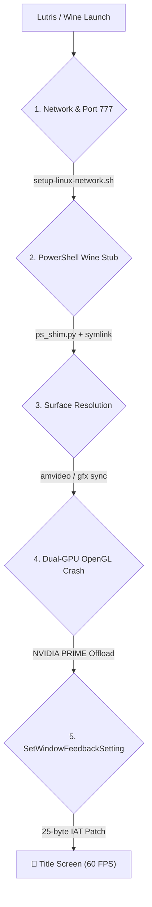

# FGO Arcade on Linux: Complete Setup & Compatibility Guide

> **Target Version**: FGO Arcade Offline Local Platform V1.01 / V1.02 (Cloud23333 + Scooby EN Patch)  
> **Tested Environments**: CachyOS / Arch Linux / Ubuntu / Steam Deck (Proton / Lutris / SLR)  

---

## 🚀 1-Click Quick Start

If you downloaded the FGOAC scooby release zip and unzipped it beside `App` and `Server`:

```bash
# 1. Enter the linux support folder and run the setup script
cd linux
chmod +x setup-fgoa-linux.sh setup-linux-network.sh
./setup-fgoa-linux.sh

# 2. Open Lutris, configure the game profile, and press Play!
```

---

## 📋 Prerequisites & Host Packages

Ensure your Linux host has the required packages installed:

### Arch Linux / CachyOS:
```bash
sudo pacman -S powershell python-yaml noto-fonts-cjk nvidia-utils lib32-nvidia-utils vulkan-icd-loader lib32-vulkan-icd-loader
```

### Ubuntu / Debian:
```bash
sudo apt install powershell python3-yaml fonts-noto-cjk libvulkan1
```

---

## ⚙️ Lutris Configuration

Create a new Wine game entry in Lutris with the following settings:

* **Game Options**:
  * **Executable**: `<path_to_game>/FGOAC scooby.exe`
  * **Working directory**: `<path_to_game>`
  * **Wine prefix**: `<path_to_wineprefix>` (e.g. `~/.local/share/wineprefixes/fgoa`)
* **Runner Options**:
  * **Wine version**: `Proton-CachyOS-SLR` or `GE-Proton` or `wine-cachyos` (64-bit)
  * **Enable DXVK / VKD3D**: On
* **System Options > Environment Variables**:
  * `DOTNET_BUNDLE_EXTRACT_BASE_DIR` = `C:\dotnet_bundle_extract` *(Essential: prevents single-file .NET bundle extraction hangs in Wine)*
  * `UMU_NO_RUNTIME` = `1`
  * `__NV_PRIME_RENDER_OFFLOAD` = `1` (for hybrid AMD/Intel + NVIDIA GPUs)
  * `__GLX_VENDOR_LIBRARY_NAME` = `nvidia`
  * `__VK_LAYER_NV_optimus` = `NVIDIA_only`
  * `DXVK_FILTER_DEVICE_NAME` = `GeForce`
  * `WINEDLLOVERRIDES` = `xinput1_4=n,b`

> **Note on `DOTNET_BUNDLE_EXTRACT_BASE_DIR`**: `FGOAC scooby.exe` is a self-contained single-file .NET Core application. Defining `C:\dotnet_bundle_extract` guarantees that the extracted WPF and BAML assemblies reside in a clean, predictable location within the Wine prefix, avoiding startup hangs or %TEMP% virtualization permission errors.

You can also import `linux/fgolocalplatform.lutris.yml` directly into Lutris.

---

## 🔍 Technical Architecture & 5 Compatibility Hurdles

When running on Linux under Wine/Proton, five specific hurdles were identified and resolved:



### 1. Privileged Ports & Loopback IP (`192.168.100.1`)
* **Problem**: Artemis binds to port `777`, which Linux considers privileged (`< 1024`). The game connects to `192.168.100.1`.
* **Fix**: `setup-linux-network.sh` sets `net.ipv4.ip_unprivileged_port_start = 0`, `kernel.yama.ptrace_scope = 0`, and installs `/etc/systemd/system/fgoa-vnet.service` adding `192.168.100.1/32` to `lo`.

### 2. PowerShell Stub on Wine
* **Problem**: Wine's built-in `powershell.exe` is an empty stub that returns exit code 0 without executing `.ps1` scripts.
* **Fix**: `linux/ps_shim.py` intercepts launcher calls and manages MariaDB (:8888), Artemis (:777/7777/9999), and game injection.

### 3. Surface Resolution & AMVideo Synchronization
* **Problem**: Direct3D/AMVideo memory patch failure (`hr=80070057`) if `[amvideo]` and `[gfx]` sections in `segatools.ini` disagree.
* **Fix**: `ps_shim.py` dynamically synchronizes both sections (1280x720 windowed).

### 4. Hybrid Dual-GPU Crash (`0xC0000005` at `0x0`)
* **Problem**: FGO Arcade requires NVIDIA OpenGL extensions (`GL_NV_bindless_texture`). On hybrid laptops, Wine defaults to AMD/Intel iGPU where `wglGetProcAddress` returns NULL.
* **Fix**: Force NVIDIA offload via `__NV_PRIME_RENDER_OFFLOAD=1` and `__GLX_VENDOR_LIBRARY_NAME=nvidia`.

### 5. Windows 8+ Touch Feedback API Crash (`0x80000100`)
* **Problem**: `ago.exe` imports `SetWindowFeedbackSetting` from `USER32.dll`. Wine does not implement this touch ripple API, causing an unhandled `STATUS_WINE_STUB` exception.
* **Fix**: `setup-fgoa-linux.sh` patches 25 bytes in `App/ago.exe` IAT (offset `0x1971978`), redirecting the import to `SetWindowTextA`.

---

## 🎮 Controls & Input Mapping

* **Keyboard & Mouse**:
  * `WASD`: Movement
  * `Right Click` / `J`: Attack
  * `Space` / `K`: Noble Phantasm
  * `Left Shift`: Dash
  * `F` / `E`: Target Lock
  * `Left Click`: Virtual Touch Screen
  * `Enter`: Scan default Aimé card (ID 1)
  * `F3`: Insert Coin
  * `F1` / `F2`: Test / Service menu
  * `F10` / `F11`: Camera / Debug rendering toggles
* **Gamepad (Xbox / DualSense)**:
  * Configure `XInput` or `DualSense` in Launcher **Settings > Controls**.

---

## 🛠️ Troubleshooting FAQ

| Issue | Code | Cause | Fix |
| :--- | :--- | :--- | :--- |
| `PermissionError: [Errno 13]` | `EACCES` | Port 777 blocked by Linux kernel | Run `sudo ./linux/setup-linux-network.sh` |
| Crash at `0000000000000000` | `0xC0000005` | AMD iGPU loaded without bindless texture support | Set `__NV_PRIME_RENDER_OFFLOAD=1` in Lutris env |
| Crash in `ntdll.dll` | `0x80000100` | Missing Wine export `SetWindowFeedbackSetting` | Run `./linux/setup-fgoa-linux.sh` to patch `ago.exe` IAT |
| `native-surface patch failed` | `hr=80070057` | Resolution mismatch between `[amvideo]` and `[gfx]` | Run via Scooby launcher / `ps_shim.py` which auto-syncs |
| Lingering background server | Ports occupied | Previous `amdaemon` or `ago` process running | Run `pkill -f "ago.exe\|amdaemon.exe\|inject.exe"` |
